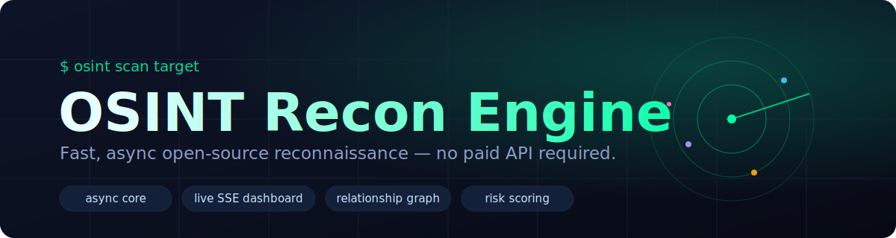

<div align="center">



<br>

**Fast, async open-source reconnaissance — with a live web dashboard and _no paid API required_.**

[](https://github.com/AMREESHAYS/OSINT-tool/actions/workflows/ci.yml)
[](LICENSE)
[](https://www.python.org/)
[](https://github.com/astral-sh/ruff)
[](#)

</div>

> [!WARNING]
> Only scan targets you own or are explicitly authorized to test.

---

A reconnaissance engine for security learners, bug-bounty hunters, and researchers. One async core drives a **Rich CLI** with live progress, a **FastAPI SSE dashboard** that streams findings as they land, and multi-format reports — every default path works free and offline.

## ✨ Features

- **⚡ Async core** — one orchestrator fans modules out over a shared `httpx` client; a failing module never aborts the scan.
- **🖥️ Rich CLI** — a live progress panel, severity-colored findings, and a heuristic risk verdict.
- **🌐 Live web dashboard** — React + SSE; modules stream in one-by-one with a risk gauge and an interactive relationship graph.
- **🕸️ Relationship graph** — target → subdomains → tech → open ports → JS endpoints → profiles, built from findings.
- **📄 Reports** — JSON, Markdown, and self-contained HTML for bug-bounty writeups.
- **🧩 12 modules** — DNS, subdomains, ports, headers, tech, crawler, dir bruteforce, JS endpoints, usernames, email/MX, plus optional screenshots & breach lookups.
- **🔓 No paid API required** — optional Claude summaries, Playwright screenshots, and HIBP breach lookups all degrade gracefully to the free path.

## 🚀 Quick start

```bash
# 1. Clone
git clone https://github.com/AMREESHAYS/OSINT-tool.git
cd OSINT-tool

# 2. Install the CLI (Python 3.11+)
pipx install .            # isolated install  ·  or:  pip install .
#   no install at all →   uvx --from . osint scan example.com

# 3. Scan
osint scan example.com   # full domain recon with a live panel
```

> **Port scanning uses `nmap`.** Install it (`sudo apt install nmap` / `brew install nmap`) for the ports
> module, or pass `--no-nmap` — the scan runs fine either way (a missing `nmap` just yields an "unavailable" notice).

<div align="center">
<em>DNS, subdomains, ports, headers, tech, crawler, dir-brute, JS endpoints — streamed live, scored, graphed.</em>
</div>

### More scans

```bash
osint scan example.com --html report.html   # shareable HTML report
osint scan user@example.com                  # email recon (MX, optional breaches)
osint scan octocat                           # username footprint (~15 platforms)
osint scan 8.8.8.8 --only ports              # a single module
osint modules                                # list available modules
```

**Flags:** `--json/--md/--html <path>` · `--only` · `--skip` · `--no-nmap` · `--ai` · `--concurrency` · `--timeout` · `-q/--quiet`

### Docker (bundles `nmap`, no local Python needed)

```bash
git clone https://github.com/AMREESHAYS/OSINT-tool.git && cd OSINT-tool
docker build -t osint .
docker run --rm osint scan example.com
```

## 🏗️ Architecture

```text
                                          ┌──▶  Rich CLI  +  JSON / MD / HTML reports
 target ─▶ classify ─▶ async orchestrator ─▶ ScanReport ──┤
                          │                 (+ risk score) └──▶  FastAPI SSE ─▶ React dashboard
                          │                                      (live findings · risk gauge · graph)
                          ▼
          isolated modules (one failure never aborts the scan):
          dns · subdomains · ports · headers · tech · crawler · dir-brute
          js-endpoints · username · email · screenshot · breach
```

One `ScanReport` (Pydantic) is the single source of truth — shared by the CLI, the reporters, the SSE API, and the TypeScript frontend. No adapter layers.

## 🌐 Web dashboard

Two processes — the SSE API and the Vite dev server:

```bash
osint serve                              # http://127.0.0.1:8000  (streams findings live)

cd osint-dashboard/frontend
npm install && npm run dev               # http://localhost:5173
```

Open <http://localhost:5173>, enter a target, and watch modules stream in with a live risk gauge and relationship graph. Set `VITE_API_BASE_URL` to point the frontend at a non-default API origin.

## 🧩 Optional enrichments

All degrade gracefully; none are required, and the default path stays paid-API-free.

```bash
pip install 'osint[ai,screenshots]'      # optional extras
playwright install chromium              # for screenshots
export ANTHROPIC_API_KEY=...             # AI summary via Claude (else heuristic)
export HIBP_API_KEY=...                  # email breach lookups (else skipped)
```

| Enrichment | Default (free) | Opted-in |
|---|---|---|
| **AI summary** | heuristic narrative | Claude (`--ai` / `?ai=true` + key) |
| **Screenshots** | "unavailable" notice | homepage PNG (Playwright) |
| **Breaches** | "skipped" notice | HaveIBeenPwned (`HIBP_API_KEY`) |

## 📦 Modules

| Target | Modules |
|---|---|
| **domain** | dns · subdomains (crt.sh) · ports (nmap) · security headers · tech fingerprint · crawler · directory bruteforce · JS endpoint/secret extraction · screenshot |
| **email** | email/MX · breach lookups |
| **username** | footprint across ~15 platforms |
| **ip** | ports |

All findings feed a weighted **risk score** (INFO → CRITICAL).

## 🛠️ Development

```bash
pip install -e ".[dev]"
ruff check osint/ tests/
pytest
```

Tests make no live network calls, use no real browser, and call no real LLM (`respx` + monkeypatching). CI runs ruff + pytest on every push.

## 🗺️ Status

| Phase | Scope | State |
|---|---|---|
| **1** | Async core · CLI · reports | ✅ Shipped |
| **2a** | SSE API · live dashboard · graph | ✅ Shipped |
| **2b** | AI summary · screenshots · breach lookups | ✅ Shipped |

## 📄 License

[MIT](LICENSE) © AMREESHAYS
